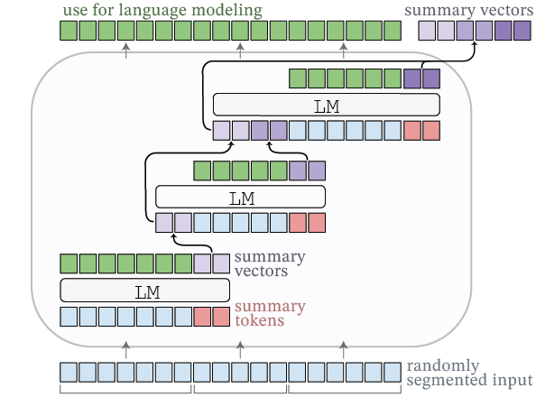

# Adapting Language Models to Compress Long Contexts

This is the official implementation of the paper [`Adapting Language Models to Compress Long Contexts`](https://arxiv.org/abs/2305.14788).



### Install
Setup a new environment and install the most recent version of [pytorch](https://pytorch.org/),
followed by these libraries
```
pip install transformers==4.28.1 datasets==2.11.0 wandb
```

### Training
`train.sh` is the main method for training AutoCompressors.
It features the most important hyperparameters for training and
shows an example of how to call `train.py`.
You may have to some hyperparameters, like the number GPUs, depending on the system.
The script should be easy to start with, since it uses pre-tokenized datasets from the huggingface hub.

We implement flash attention via `torch.nn.functional.scaled_dot_product_attention`, which you can use by adding `--fast_attention` to `train.sh`. This lowers the GPU memory requirements during training substantially. Note that this is experimental and requires the preview version of pytorch. We have encountered some issues with using fast attention during evaluation, especially with `use_cache=True`, so we recommend only using the fast attention during training.

### Pre-trained models
Coming soon...

## Bug or Questions?
If you have any questions related to the code or the paper, feel free to email
Alexis and Alexander (`achevalier@ias.edu, awettig@cs.princeton.edu`).
If you encounter a problem or bug when using the code, you can open an issue.
Please try to specify the problem with detail so we can help you quickly!

## Citation
```bibtex
@article{chevalier2023adapting,
   title={Adapting Language Models to Compress Contexts},
   author={Chevalier, Alexis and Wettig, Alexander and Ajith, Anirudh and Chen, Danqi},
   year={2023}
}
```
